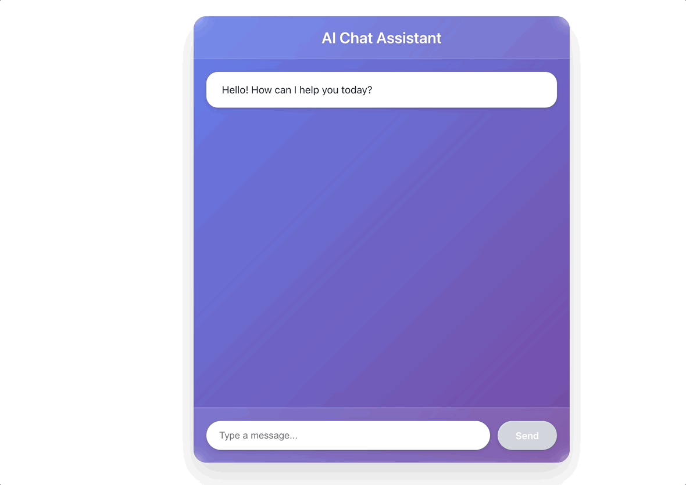

# AI Agent — NestJS + React Boilerplate

> *"Good artists borrow, great artists steal."* — Igor Stravinsky  
> So go ahead, steal this. That's what it's here for. 🎨

---

> **⚡ Currently supports:** Google Gemini  
> **🚧 Coming soon:** OpenAI, Anthropic Claude, and more — each in its own branch for a clean, focused setup

---

## TL;DR — Quick Start

**Want to get started in 60 seconds?**

```bash
# 1. Clone this repo
git clone https://github.com/your-username/ai-agent-nest-react-boilerplate.git
cd ai-agent-nest-react-boilerplate

# 2. Get a Gemini API key from https://ai.google.dev/

# 3. Add it to your .env file
cp apps/server/.env.example apps/server/.env
# Then edit apps/server/.env and add: GEMINI_API_KEY=your_key_here

# 4. Install & run
pnpm install
pnpm dev

# 5. Open http://localhost:5173
```

**That's it.** You now have a working AI agent with a chat interface.

---

## What Is This?

This is a **production-ready monorepo boilerplate** for building **AI-powered agents** and **chatbots**.

### Who is this for?

- Developers who want to build **agentic AI applications**
- Teams prototyping **chatbot interfaces** with modern LLMs
- Anyone tired of stitching together boilerplate from scratch
- Hackers who prefer a **starting point** over a rigid framework

### What's included?

- **TypeScript** — type-safe from end to end
- **NestJS** — backend API & agent orchestration
- **React** — chat-based frontend UI
- **Shared packages** — reusable types & utilities
- **Gemini integration** — ready to chat with Google's AI models
- **Clean architecture** — designed to scale and adapt

**This is NOT a locked framework.**  
Copy it. Fork it. Gut it. Rebuild it. Make it yours.

---

## Demo



---

## Monorepo Structure

```txt
apps/
  server/        # NestJS backend (API + AI agent logic)
  web/           # React frontend (chat UI)
packages/
  shared/        # Types, utilities, shared code

Each app is isolated with its own:
- Environment variables
- Dependencies
- Lifecycle

But they share common code where it makes sense.
```

---

## Getting Started — The Full Guide

### 1. Clone the repository

```bash
git clone https://github.com/your-username/ai-agent-nest-react-boilerplate.git
cd ai-agent-nest-react-boilerplate
```

### 2. Set up environment variables

This boilerplate currently uses **Google Gemini** as the LLM provider.

#### Backend (apps/server)

**Step 1:** Copy the example env file

```bash
cp apps/server/.env.example apps/server/.env
```

**Step 2:** Get a Gemini API key

1. Visit [Google AI Studio](https://ai.google.dev/)
2. Sign in with your Google account
3. Click "Get API Key"
4. Generate a new API key

**Step 3:** Add your API key to `.env`

Open `apps/server/.env` and add:

```env
GEMINI_API_KEY=your_actual_api_key_here
```

> ⚠️ **Important:** `.env` files are **not committed** to the repository.  
> Only `.env.example` files are tracked in Git.

#### Frontend (apps/web)

No environment variables needed for the frontend in the default setup.  
If you add them later, follow the same pattern:

```bash
cp apps/web/.env.example apps/web/.env
```

---

### 3. Install dependencies

You can use **pnpm** (recommended) or **npm**.

#### Using pnpm (faster, better for monorepos)

```bash
pnpm install
```

#### Using npm

```bash
npm install
```

---

### 4. Run the project (development mode)

From the repository root, run:

```bash
pnpm dev
```

or

```bash
npm run dev
```

This command will start **both**:

- 🟢 **NestJS backend** — API server (usually on `http://localhost:3000`)
- 🔵 **React frontend** — Chat UI (usually on `http://localhost:5173`)

---

### 5. Open the app

Once everything is running, open your browser and go to:

```
http://localhost:5173
```

You should see the chat interface. Start typing to interact with your AI agent!

---

## LLM Support

### Currently Available: Google Gemini

This boilerplate uses **Google Gemini** out of the box (main branch).

### Coming Soon: Multiple LLM Providers

Additional LLM providers will be added as **separate branches**:

- 🔜 **`openai`** branch — GPT-4, GPT-4 Turbo, GPT-4o
- 🔜 **`anthropic`** branch — Claude 3.5 Sonnet, Claude 3 Opus
- 🔜 **`ollama`** branch — Local/self-hosted models (Llama, Mistral, etc.)

> 💡 **Why separate branches?**  
> Each LLM has its own setup, dependencies, and patterns.  
> Branches let you choose the provider you need without unnecessary bloat or conflicts.

### Want to Add Your Own Provider?

The architecture is designed to be **swappable**.

Check out `apps/server/src/llm/` to see how providers are structured.  
Creating a new provider is straightforward — follow the existing patterns and you're good to go.

---

## About This Boilerplate

### Philosophy

This is a **boilerplate**, not a **framework**.

That means:

- ✅ You are **encouraged** to copy files
- ✅ You are **encouraged** to remove parts
- ✅ You are **encouraged** to reshape the architecture
- ✅ You are **encouraged** to reuse whatever helps you

The goal is to provide a **clean, opinionated starting point** for AI-driven applications — without over-engineering.

### Design Principles

- **Type-safe everywhere** — Strict TypeScript configuration
- **Separation of concerns** — Backend logic, frontend UI, shared code
- **Environment isolation** — Each app has its own config
- **Extensible** — Add new LLMs, tools, features easily
- **Not prescriptive** — Take what you need, leave what you don't

---

## Scripts Reference

From the monorepo root:

```bash
# Development mode (starts both apps)
pnpm dev

# Build everything
pnpm build

# Run tests
pnpm test

# Lint code
pnpm lint

# Type-check everything
pnpm type-check
```

For individual apps:

```bash
# Backend only
pnpm --filter server dev

# Frontend only
pnpm --filter web dev
```

---

## Tech Stack

| Layer | Technology |
|-------|-----------|
| **Language** | TypeScript |
| **Backend** | NestJS |
| **Frontend** | React + Vite |
| **LLM** | Google Gemini (swappable) |
| **Package Manager** | pnpm (or npm) |
| **Monorepo** | Turborepo / pnpm workspaces |

---

## Project Structure Details

```txt
ai-agent-nest-react-boilerplate/
├── apps/
│   ├── server/              # NestJS backend
│   │   ├── src/
│   │   │   ├── agent/       # AI agent logic
│   │   │   ├── llm/         # LLM provider integrations
│   │   │   ├── chat/        # Chat API endpoints
│   │   │   └── main.ts      # App entry point
│   │   ├── .env.example     # Example environment file - that's the one you need to modify
│   │   └── package.json
│   │
│   └── web/                 # React frontend
│       ├── src/
│       │   ├── components/  # React components
│       │   ├── hooks/       # Custom hooks
│       │   └── App.tsx      # Main app component
│       └── package.json
│
├── packages/
│   └── shared/              # Shared code
│       ├── types/           # TypeScript types
│       └── utils/           # Utilities
│
├── package.json             # Root workspace config
└── pnpm-workspace.yaml      # Workspace definition
```

---

## License & Usage

**Use it freely.**

There are **no restrictions** on copying or adapting parts of the codebase.

If this helps you build something useful or interesting — **that's exactly the point.**

---

## Contributing

Found a bug? Have an idea? Want to add a feature?

- Open an issue
- Submit a PR
- Fork it and make it your own

All contributions are welcome.

---

## Notes

- ✅ Strict TypeScript configuration
- ✅ Type-only imports enforced
- ✅ Environment variables are app-scoped (server / web)
- ✅ Designed to scale beyond a single agent or UI
- ✅ No vendor lock-in — swap out any piece you want

---

## Questions?

If you're stuck, check:

1. The [issues page](https://github.com/your-username/ai-agent-nest-react-boilerplate/issues)
2. Your `.env` file (is your API key correct?)
3. Your console logs (errors are usually helpful)

---

**Happy hacking** 🚀

*Now go build something interesting.*